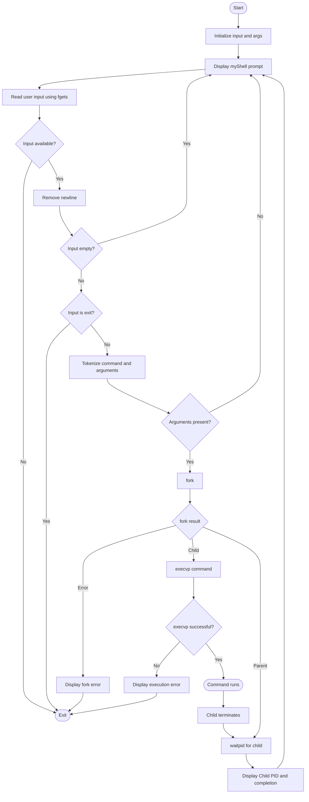

# Task 1 – Interactive Shell

**Repository:** `tejaswin-amara/OSSP_2520090104`  
**Module:** Module 02 – Process Control  
**Language:** C  
**Platform:** Linux / Ubuntu / WSL

---

## Aim

To create a simple interactive shell in C that:

1. Runs continuously using a main loop.
2. Displays a shell prompt.
3. Reads a command from the user.
4. Removes the trailing newline from the input.
5. Ignores empty commands.
6. Handles the built-in `exit` command.
7. Tokenizes the command into an argument array.
8. Creates a child process using `fork()`.
9. Executes the entered command in the child process using `execvp()`.
10. Makes the parent process wait for the child using `waitpid()`.
11. Displays the child PID and command completion message.

## Required Concepts / System Calls

| Function | Purpose |
|---|---|
| `printf()` | Displays the shell prompt and messages. |
| `fflush()` | Ensures the prompt is displayed immediately. |
| `fgets()` | Reads user input from standard input. |
| `strlen()` | Checks the length of the input. |
| `strcmp()` | Checks whether the user entered `exit`. |
| `strtok()` | Splits the command into arguments. |
| `fork()` | Creates a child process. |
| `execvp()` | Executes the requested command. |
| `waitpid()` | Makes the parent wait for the child process. |
| `perror()` | Displays an error message when a system call fails. |

## Complete Program

The source code is kept separately in [`myshell.c`](./myshell.c).

```c
#include <stdio.h>
#include <stdlib.h>
#include <string.h>
#include <unistd.h>
#include <sys/types.h>
#include <sys/wait.h>
#include <errno.h>

#define MAX_INPUT_SIZE 1024
#define MAX_ARGS 64

void strip_newline(char *str) {
    int len = strlen(str);
    if (len > 0 && str[len - 1] == '\n') {
        str[len - 1] = '\0';
    }
}

int main() {
    char input[MAX_INPUT_SIZE];
    char *args[MAX_ARGS];

    while (1) {
        // Display prompt
        printf("myShell> ");
        fflush(stdout);

        // Read input
        if (fgets(input, sizeof(input), stdin) == NULL) {
            printf("\nExiting shell...\n");
            break;
        }

        strip_newline(input);

        // Check empty command
        if (strlen(input) == 0) {
            continue;
        }

        // Exit built-in command
        if (strcmp(input, "exit") == 0) {
            break;
        }

        // Tokenization and argument parsing
        int i = 0;
        char *token = strtok(input, " ");

        while (token != NULL && i < MAX_ARGS - 1) {
            args[i++] = token;
            token = strtok(NULL, " ");
        }

        args[i] = NULL;

        if (i == 0) {
            continue;
        }

        // Fork process
        pid_t pid = fork();

        if (pid < 0) {
            perror("Fork failed");
            exit(1);
        }
        else if (pid == 0) {
            // Child process
            if (execvp(args[0], args) < 0) {
                perror("Command execution failed");
            }
            exit(1);
        }
        else {
            // Parent process
            int status;
            waitpid(pid, &status, 0);

            printf("Child PID: %d\n", pid);
            printf("Command execution completed.\n");
        }
    }

    return 0;
}
```

> **Note:** The supplied screenshot shows the same core shell logic. This complete version includes the required headers and constants so it can be compiled directly.

## Main Loop

The shell uses:

```c
while (1) {
```

Each iteration:

1. Displays `myShell>`.
2. Reads the user's command.
3. Checks for end-of-file/input failure.
4. Removes the newline character.
5. Ignores an empty command.
6. Checks whether the command is `exit`.
7. Tokenizes the command.
8. Creates a child process.
9. Executes the command in the child.
10. Waits for the child in the parent.
11. Displays completion information.
12. Returns to the prompt.

The loop terminates when the user enters `exit` or standard input reaches EOF.

## Prompt Display

```c
printf("myShell> ");
fflush(stdout);
```

`printf()` displays the prompt. `fflush(stdout)` forces it to appear immediately before the program waits for input.

Expected prompt:

```text
myShell>
```

## Reading User Input

```c
if (fgets(input, sizeof(input), stdin) == NULL) {
    printf("\nExiting shell...\n");
    break;
}
```

`fgets()` reads the command. If no more input is available, the program exits the loop.

## Removing the Newline

```c
void strip_newline(char *str) {
    int len = strlen(str);
    if (len > 0 && str[len - 1] == '\n') {
        str[len - 1] = '\0';
    }
}
```

When the user presses Enter, `fgets()` normally stores the newline. Removing it allows string comparisons such as `strcmp(input, "exit")` to work correctly.

## Empty Commands

```c
if (strlen(input) == 0) {
    continue;
}
```

Pressing Enter without a command causes the shell to skip the current iteration and display the prompt again.

## Exit Condition

```c
if (strcmp(input, "exit") == 0) {
    break;
}
```

Entering `exit` terminates the main loop and ends the shell.

## Tokenization and Argument Parsing

For:

```text
ls -l
```

The argument array becomes:

```text
args[0] = "ls"
args[1] = "-l"
args[2] = NULL
```

The final `NULL` is required by `execvp()` to mark the end of the argument list.

## Creating the Child Process

```c
pid_t pid = fork();
```

| Return value | Meaning |
|---:|---|
| `< 0` | Fork failed. |
| `0` | Code is executing in the child process. |
| `> 0` | Code is executing in the parent process; value is the child's PID. |

## Child Process – Execute Command

```c
else if (pid == 0) {
    if (execvp(args[0], args) < 0) {
        perror("Command execution failed");
    }
    exit(1);
}
```

The child uses `execvp()` to replace itself with the requested command.

## Parent Process – Wait for Child

```c
else {
    int status;
    waitpid(pid, &status, 0);

    printf("Child PID: %d\n", pid);
    printf("Command execution completed.\n");
}
```

The parent waits until the child finishes and then reports completion.

## Control Flow Diagram



### Control Flow Summary

```text
START
  |
  v
Display Prompt
  |
  v
Read Input
  |
  +---- EOF? ---- YES ---> EXIT
  |
  NO
  |
  v
Remove Newline
  |
  v
Empty? ---- YES ---> Display Prompt
  |
  NO
  |
  v
exit? ----- YES ---> EXIT
  |
  NO
  |
  v
Tokenize Arguments
  |
  v
fork()
 /    \
/      \
Child  Parent
 |       |
 v       v
execvp  waitpid
 |       |
 v       v
Run     Wait
Command  |
 \       /
  \     /
   v   v
Command Complete
      |
      v
Display Prompt
      |
      +----> Repeat
```

## Compilation and Execution

```bash
mkdir simple_shell
cd simple_shell
nano myshell.c
gcc -o myshell myshell.c
./myshell
```

## Test Case 1 – `echo`

Input:

```text
myShell> echo Hello
```

Expected output:

```text
Hello
Child PID: <PID>
Command execution completed.
```

The exact PID changes each time the program runs.

## Test Case 2 – `ls -l`

Input:

```text
myShell> ls -l
```

Expected behavior:

- The child executes `ls -l`.
- Directory contents are displayed.
- The child PID is printed.
- `Command execution completed.` is printed.
- The shell returns to `myShell>`.

## Test Case 3 – Empty Input

Press Enter without entering a command.

Expected behavior:

```text
myShell>
myShell>
```

The shell remains active and displays the prompt again.

## Test Case 4 – Exit

Input:

```text
myShell> exit
```

The `exit` condition is detected, the main loop terminates, and the program exits.

## Screenshot Evidence

Keep the screenshots in the [`screenshots`](./screenshots/) folder, not in the document folder itself.

### Screenshot 1 – Source Code

Keep the screenshot showing `myshell.c` opened in GNU nano, including the main loop, prompt, input handling, tokenization, `fork()`, `execvp()`, and `waitpid()`.

### Screenshot 2 – Terminal Execution

Keep the terminal screenshot showing:

```text
mkdir simple_shell
cd simple_shell
nano myshell.c
gcc -o myshell myshell.c
./myshell
```

and the test commands:

```text
myShell> echo Hello
Hello
Child PID: 1964
Command execution completed.

myShell> ls -l
```

The exact PID can differ between runs. The screenshot also demonstrates that the shell returns to the prompt after command execution.
