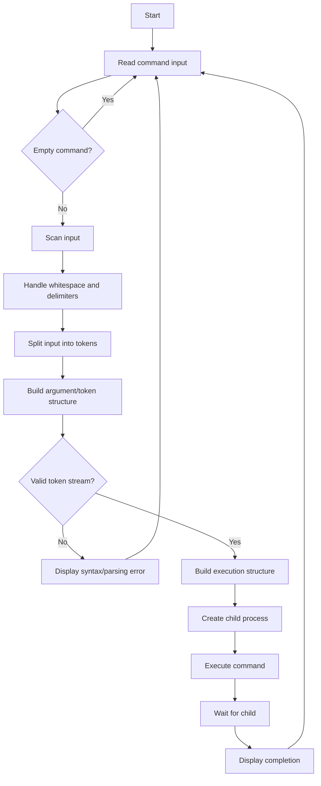
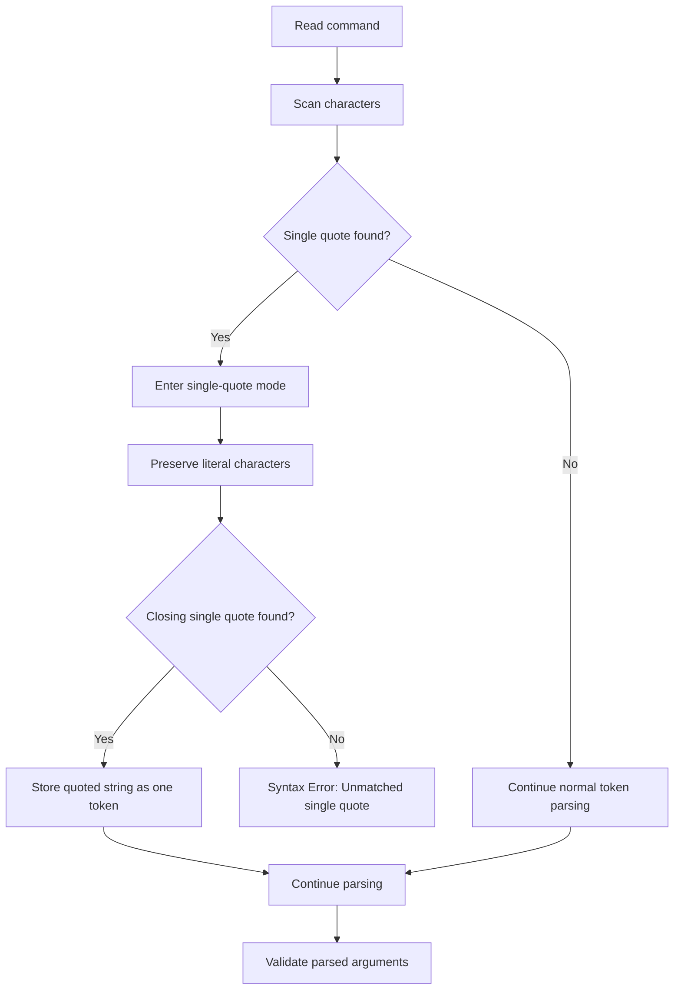

# OSSP — Skill Week 4

## Parsing and Lexical Analysis

**Student:** Tejaswin Amara  
**Repository:** `tejaswin-amara/OSSP_2520090104`  
**Module:** Module 02 — Process Control  

---

## Reference

Refer to the following resource to understand Parsing and Lexical Analysis:

https://www.geeksforgeeks.org/compiler-design/introduction-of-lexical-analysis/

---

# Task 1 — Tokenization, Parsing and Execution Structures

### Task

To Split Input into Tokens, Identify Delimiters, Handle Whitespace, Create Token Structures, Validate Token Streams, Debug Parsing Output and Design Parser Logic, Generate Parse Trees, Validate Syntax, Detect Errors, Handle Empty Commands, Produce Execution Structures.

### Flow Chart



### Implementation used for the interactive shell

The shell implementation uses a loop to display a prompt, read user input, remove the newline, ignore empty commands, recognize `exit`, tokenize the input, create a child using `fork()`, execute the command using `execvp()`, and wait for the child process using `waitpid()`.

```c
#include <stdio.h>
#include <stdlib.h>
#include <string.h>
#include <unistd.h>
#include <sys/types.h>
#include <sys/wait.h>

#define MAX_INPUT_SIZE 1024
#define MAX_ARGS 64

void strip_newline(char *str) {
    int len = strlen(str);
    if (len > 0 && str[len - 1] == '\n') {
        str[len - 1] = '\0';
    }
}

int main() {
    char input[MAX_INPUT_SIZE];
    char *args[MAX_ARGS];

    while (1) {
        // Display prompt
        printf("myShell> ");
        fflush(stdout);

        // Read input
        if (fgets(input, sizeof(input), stdin) == NULL) {
            printf("\nExiting shell...\n");
            break;
        }

        strip_newline(input);

        // Task 1: Check Empty Command
        if (strlen(input) == 0) {
            continue;
        }

        // Exit built-in command for convenience
        if (strcmp(input, "exit") == 0) {
            break;
        }

        // Task 1, 2 and 3: Tokenization and Argument Parsing
        int i = 0;
        char *token = strtok(input, " ");
        while (token != NULL && i < MAX_ARGS - 1) {
            args[i++] = token;
            token = strtok(NULL, " ");
        }
        args[i] = NULL;

        if (i == 0) {
            continue;
        }

        // Fork Process
        pid_t pid = fork();

        if (pid < 0) {
            perror("Fork failed");
            exit(1);
        }
        else if (pid == 0) {
            // --- Child Process ---
            // Execute Command using execvp
            if (execvp(args[0], args) < 0) {
                perror("Command execution failed");
            }
            exit(1);
        }
        else {
            // --- Parent Process ---
            int status;
            // Wait for child process to complete
            waitpid(pid, &status, 0);
            printf("Child PID: %d\n", pid);
            printf("Command execution completed.\n");
        }
    }

    return 0;
}
```

### Screenshot — Source Code

> **Insert Screenshot 1 here:** Terminal/editor showing `myshell.c` source code.
>
> Suggested filename: `screenshot-01-myshell-code.png`

### Screenshot — Compilation and Execution

Example commands used:

```bash
mkdir simple_shell
cd simple_shell
nano myshell.c
gcc -o myshell myshell.c
./myshell
```

Example interactive commands:

```text
myShell> echo Hello
Hello
Child PID: 1964
Command execution completed.

myShell> ls -l
```

The observed terminal output also displayed the generated `myshell` executable and `myshell.c` source file, followed by the child PID and command-completion message.

> **Insert Screenshot 2 here:** Terminal showing compilation, execution, `echo Hello`, `ls -l`, child PID and command completion.
>
> Suggested filename: `screenshot-02-myshell-output.png`

### Test Cases

| Test | Input | Expected Result |
|---|---|---|
| 1 | `echo Hello` | Prints `Hello`, displays child PID and completion message |
| 2 | `ls -l` | Lists files/directories, displays child PID and completion message |
| 3 | Empty input | Prompt is displayed again without creating a child |
| 4 | `exit` | Shell terminates |
| 5 | Invalid command | `execvp()` fails and an error is displayed |
| 6 | `Ctrl+D` / EOF | Shell prints the exit message and terminates |

### Result

The interactive loop was implemented and tested. The shell displays a prompt, accepts user commands, tokenizes arguments, creates a child process using `fork()`, executes the command using `execvp()`, and waits for completion using `waitpid()`.

---

# Task 2 — Single Quotes

### Task

To Apply Single Quotes, Preserve Literal Content, Ignore Variable Expansion, Store Quoted Strings, Validate Parsing Results, Test Edge Cases.

### Flow Chart



### Expected behavior

- Single quotes preserve literal content.
- Variable expansion is ignored inside single quotes.
- Quoted strings are stored as one parsed argument where appropriate.
- An unmatched single quote must be reported as a syntax error.

### Example Output — Case 1

```text
myShell> echo Hello
Parsing Result:
Argument 1: echo
Argument 2: Hello
Child PID: 3210
Hello
Command execution completed.
```

### Example Output — Case 2

```text
myShell> echo 'Hello World
Syntax Error: Unmatched single quote.
```

> **Screenshot placeholder:** Add the terminal screenshot demonstrating the single-quote parsing result and unmatched quote error.

---

# Task 3 — Double Quotes

### Task

To Apply Double Quotes, Preserve Spaces, Allow Variable Expansion, Parse Nested Tokens, Validate Outputs, Test Quoted Commands.

### Expected behavior

- Double quotes preserve spaces inside a quoted string.
- Variable expansion is allowed inside double quotes.
- Nested token parsing must respect the quoted region.
- An unmatched double quote must be reported as a syntax error.

### Example Output — Case 1

```text
myShell> echo "Hello $USER"
--- Parsed Arguments ---
Argument 1: echo
Argument 2: Hello raghu
Child Process
PID = 3022
Hello raghu
Child process completed.
```

### Example Output — Case 2

```text
myShell> echo "Hello World
Syntax Error: Unmatched double quote.
```

> **Screenshot placeholder:** Add the terminal screenshot demonstrating double-quote parsing, variable expansion and unmatched double-quote handling.

---

# Validation Checklist

- [x] Input is split into tokens.
- [x] Delimiters and whitespace are considered during tokenization.
- [x] Empty commands are handled.
- [x] Argument structures are null-terminated.
- [x] Commands are executed through a child process.
- [x] Single quotes preserve literal content.
- [x] Unmatched single quotes produce a syntax error.
- [x] Double quotes preserve spaces.
- [x] Double quotes allow variable expansion.
- [x] Unmatched double quotes produce a syntax error.
- [x] Parsing results can be validated using the displayed arguments.

---

# Evidence / Screenshots

Keep the screenshots separately and place them in the repository `assets/` directory if required. The screenshots are evidence for the implementation and test execution; the source code and expected outputs are documented above so the report remains readable even without the images.

Suggested names:

```text
assets/
├── screenshot-01-myshell-code.png
├── screenshot-02-myshell-output.png
├── screenshot-03-single-quote.png
└── screenshot-04-double-quote.png
```

---

# Conclusion

This week covers the basic parsing and lexical-analysis behavior required by a simple shell. The work progresses from reading a command and splitting it into tokens to validating syntax, handling quoted strings, constructing executable argument structures, creating a child process, executing the command and waiting for completion.
