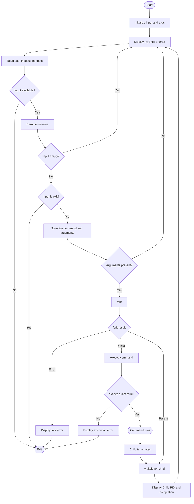

# OSSP Lab – Interactive Shell and File Copy Using System Calls

**Repository:** `tejaswin-amara/OSSP_2520090104`  
**Module:** Module 02 – Process Control / Module 05 – File Systems concepts  
**Language:** C  
**Platform:** Linux / Ubuntu / WSL  

---

## Task 1: Create Main Loop, Display Prompt, Read User Input, Handle Exit Conditions, Design Control Flow Diagram, and Test Interactive Loop

### 1. Aim

To create a simple interactive shell in C that:

1. Runs continuously using a main loop.
2. Displays a shell prompt.
3. Reads a command from the user.
4. Removes the trailing newline from the input.
5. Ignores empty commands.
6. Handles the built-in `exit` command.
7. Tokenizes the command into an argument array.
8. Creates a child process using `fork()`.
9. Executes the entered command in the child process using `execvp()`.
10. Makes the parent process wait for the child using `waitpid()`.
11. Displays the child PID and command completion message.

---

## 2. Required Concepts / System Calls

| Function | Purpose |
|---|---|
| `printf()` | Displays the shell prompt and messages. |
| `fflush()` | Ensures the prompt is displayed immediately. |
| `fgets()` | Reads user input from standard input. |
| `strlen()` | Checks the length of the input. |
| `strcmp()` | Checks whether the user entered `exit`. |
| `strtok()` | Splits the command into arguments. |
| `fork()` | Creates a child process. |
| `execvp()` | Executes the requested command. |
| `waitpid()` | Makes the parent wait for the child process. |
| `perror()` | Displays an error message when a system call fails. |

---

## 3. Complete Program

Save the program as **`myshell.c`**.

```c
#include <stdio.h>
#include <stdlib.h>
#include <string.h>
#include <unistd.h>
#include <sys/types.h>
#include <sys/wait.h>
#include <errno.h>

#define MAX_INPUT_SIZE 1024
#define MAX_ARGS 64

void strip_newline(char *str) {
    int len = strlen(str);
    if (len > 0 && str[len - 1] == '\n') {
        str[len - 1] = '\0';
    }
}

int main() {
    char input[MAX_INPUT_SIZE];
    char *args[MAX_ARGS];

    while (1) {
        // Display prompt
        printf("myShell> ");
        fflush(stdout);

        // Read input
        if (fgets(input, sizeof(input), stdin) == NULL) {
            printf("\nExiting shell...\n");
            break;
        }

        strip_newline(input);

        // Check empty command
        if (strlen(input) == 0) {
            continue;
        }

        // Exit built-in command
        if (strcmp(input, "exit") == 0) {
            break;
        }

        // Tokenization and argument parsing
        int i = 0;
        char *token = strtok(input, " ");

        while (token != NULL && i < MAX_ARGS - 1) {
            args[i++] = token;
            token = strtok(NULL, " ");
        }

        args[i] = NULL;

        if (i == 0) {
            continue;
        }

        // Fork process
        pid_t pid = fork();

        if (pid < 0) {
            perror("Fork failed");
            exit(1);
        }
        else if (pid == 0) {
            // Child process
            // Execute command using execvp
            if (execvp(args[0], args) < 0) {
                perror("Command execution failed");
            }
            exit(1);
        }
        else {
            // Parent process
            int status;

            // Wait for child process to complete
            waitpid(pid, &status, 0);

            printf("Child PID: %d\n", pid);
            printf("Command execution completed.\n");
        }
    }

    return 0;
}
```

> **Note:** The screenshot supplied with the task shows the same core shell logic. The complete version above includes the required headers and constants so that it can be compiled directly.

---

## 4. Explanation of the Main Loop

The shell uses:

```c
while (1) {
```

This creates an infinite loop. Each iteration performs the following sequence:

1. Display `myShell>`.
2. Read the user's command.
3. Check for end-of-file/input failure.
4. Remove the newline character.
5. Ignore an empty command.
6. Check whether the command is `exit`.
7. Tokenize the command.
8. Create a child process.
9. Execute the command in the child.
10. Wait for the child in the parent.
11. Display completion information.
12. Return to the prompt.

The loop terminates when the user enters `exit` or when standard input reaches EOF.

---

## 5. Prompt Display

```c
printf("myShell> ");
fflush(stdout);
```

`printf()` displays the prompt. `fflush(stdout)` forces the output to appear immediately before the program waits for user input.

Expected prompt:

```text
myShell>
```

---

## 6. Reading User Input

```c
if (fgets(input, sizeof(input), stdin) == NULL) {
    printf("\nExiting shell...\n");
    break;
}
```

`fgets()` reads the command entered by the user. If no more input is available, the program exits the loop.

---

## 7. Removing the Newline

```c
void strip_newline(char *str) {
    int len = strlen(str);
    if (len > 0 && str[len - 1] == '\n') {
        str[len - 1] = '\0';
    }
}
```

When the user presses Enter, `fgets()` normally stores the newline character. The function removes it so that string comparisons such as `strcmp(input, "exit")` work correctly.

---

## 8. Handling Empty Commands

```c
if (strlen(input) == 0) {
    continue;
}
```

If the user presses Enter without typing a command, the shell skips the rest of the current loop iteration and displays the prompt again.

---

## 9. Handling the Exit Condition

```c
if (strcmp(input, "exit") == 0) {
    break;
}
```

If the user enters:

```text
exit
```

the `break` statement terminates the main loop and the shell program ends.

---

## 10. Tokenization and Argument Parsing

For a command such as:

```text
ls -l
```

the input is divided into:

```text
args[0] = "ls"
args[1] = "-l"
args[2] = NULL
```

The code is:

```c
int i = 0;
char *token = strtok(input, " ");

while (token != NULL && i < MAX_ARGS - 1) {
    args[i++] = token;
    token = strtok(NULL, " ");
}

args[i] = NULL;
```

The final `NULL` is required by `execvp()` to mark the end of the argument list.

---

## 11. Creating the Child Process

```c
pid_t pid = fork();
```

`fork()` creates a new child process.

The return value determines which process is running:

| Return value | Meaning |
|---:|---|
| `< 0` | Fork failed. |
| `0` | Code is executing in the child process. |
| `> 0` | Code is executing in the parent process; value is the child's PID. |

---

## 12. Child Process – Execute Command

```c
else if (pid == 0) {
    if (execvp(args[0], args) < 0) {
        perror("Command execution failed");
    }
    exit(1);
}
```

The child process uses `execvp()` to replace itself with the requested command.

Example:

```text
ls -l
```

causes the child to execute the `ls` program with the `-l` argument.

---

## 13. Parent Process – Wait for Child

```c
else {
    int status;
    waitpid(pid, &status, 0);

    printf("Child PID: %d\n", pid);
    printf("Command execution completed.\n");
}
```

The parent waits until the child finishes. This prevents the shell from immediately accepting another command while the previous command is still executing.

---

# 14. Control Flow Diagram



### Control Flow Summary

```text
START
  |
  v
Display Prompt
  |
  v
Read Input
  |
  +---- EOF? ---- YES ---> EXIT
  |
  NO
  |
  v
Remove Newline
  |
  v
Empty? ---- YES ---> Display Prompt
  |
  NO
  |
  v
exit? ----- YES ---> EXIT
  |
  NO
  |
  v
Tokenize Arguments
  |
  v
fork()
 /    \
/      \
Child  Parent
 |       |
 v       v
execvp  waitpid
 |       |
 v       v
Run     Wait
Command  |
 \       /
  \     /
   v   v
Command Complete
      |
      v
Display Prompt
      |
      +----> Repeat
```

---

# 15. Compilation and Execution

Create a directory and source file:

```bash
mkdir simple_shell
cd simple_shell
nano myshell.c
```

Compile:

```bash
gcc -o myshell myshell.c
```

Run:

```bash
./myshell
```

---

# 16. Test Case 1 – `echo`

Input:

```text
myShell> echo Hello
```

Expected output:

```text
Hello
Child PID: <PID>
Command execution completed.
```

The exact PID changes each time the program is executed.

---

# 17. Test Case 2 – `ls -l`

Input:

```text
myShell> ls -l
```

Expected behavior:

- The child process executes `ls -l`.
- Directory contents are displayed.
- The child PID is printed.
- `Command execution completed.` is printed.
- The shell returns to `myShell>`.

---

# 18. Test Case 3 – Empty Input

Input:

```text
myShell>
```

Press Enter without entering a command.

Expected behavior:

```text
myShell> 
myShell> 
```

The shell remains active and displays the prompt again.

---

# 19. Test Case 4 – Exit

Input:

```text
myShell> exit
```

Expected behavior:

- The `exit` condition is detected.
- The main loop terminates.
- The program exits.

---

# 20. Test Evidence – Screenshot 1

**Keep the screenshot showing the source code in this section.**

> Screenshot to insert: `myshell.c` opened in GNU nano, showing the main loop, prompt, input handling, tokenization, `fork()`, `execvp()`, and `waitpid()`.

---

# 21. Test Evidence – Screenshot 2

**Keep the terminal execution screenshot in this section.**

The supplied terminal test demonstrates:

```text
mkdir simple_shell
cd simple_shell
nano myshell.c
gcc -o myshell myshell.c
./myshell
```

The supplied test then demonstrates commands including:

```text
myShell> echo Hello
Hello
Child PID: 1964
Command execution completed.

myShell> ls -l
```

The terminal screenshot also shows the generated `myshell` executable and `myshell.c` source file and demonstrates that the shell returns to the prompt after command execution.

> **Screenshot to insert:** terminal compilation and execution result.

---

# Task 2: Copy File1.txt to File2.txt Using System Calls

## 22. Aim

To copy the contents of `File1.txt` to `File2.txt` using the following UNIX/Linux system calls:

1. `open()`
2. `read()`
3. `write()`
4. `close()`

The program should not use high-level file functions such as `fopen()`, `fread()`, `fwrite()`, or `fclose()` for the actual copying operation.

---

## 23. System Calls Used

### `open()`

**Syntax:**

```c
open("filename.txt", modes, permissions);
```

**Example:**

```c
open("First_Prgm.txt", O_CREAT | O_WRONLY, 0644);
```

### Table 1: Modes of `open()` System Call

| Flag | Purpose |
|---|---|
| `O_RDONLY` | Open for read only. |
| `O_WRONLY` | Open for write only. |
| `O_RDWR` | Open for both read and write. |
| `O_CREAT` | Create the file if it does not exist. |
| `O_TRUNC` | Truncate (empty) an existing file. |
| `O_APPEND` | Append data to the end of the file. |
| `O_EXCL` | Fail if the file already exists; used with `O_CREAT`. |

---

### `read()`

**Syntax:**

```c
read(int fd, void *buf, size_t count);
```

**Example:**

```c
read(fd, buffer, 100);
```

Example supplied in the task:

```c
#include <stdio.h>
#include <unistd.h>

int main()
{
    char buffer[100];
    int n;

    printf("Enter some text: ");
    n = read(0, buffer, sizeof(buffer) - 1);
    buffer[n] = '\0';   // Null-terminate the string
    printf("You entered: %s", buffer);

    return 0;
}
```

---

### `write()`

**Syntax:**

```c
write(int fd, const void *buf, size_t count);
```

**Example:**

```c
write(fd, message, 11);
```

Example supplied in the task:

```c
#include <unistd.h>

int main()
{
    write(1, "Hello World\n", 12);
    return 0;
}
```

---

### `close()`

The `close()` system call closes an open file descriptor.

**Syntax:**

```c
close(fd);
```

It is important to close both the source and destination file descriptors after the copy is complete.

---

# 24. Complete File Copy Program

Save the following as **`file_copy.c`**.

```c
#include <stdio.h>
#include <stdlib.h>
#include <fcntl.h>
#include <unistd.h>
#include <errno.h>

#define BUFFER_SIZE 1024

int main()
{
    int source_fd, dest_fd;
    char buffer[BUFFER_SIZE];
    ssize_t bytes_read;
    ssize_t bytes_written;

    // Open File1.txt for reading
    source_fd = open("File1.txt", O_RDONLY);

    if (source_fd < 0)
    {
        perror("Error opening File1.txt");
        return 1;
    }

    // Open File2.txt for writing.
    // Create it if it does not exist and empty it if it already exists.
    dest_fd = open("File2.txt", O_WRONLY | O_CREAT | O_TRUNC, 0644);

    if (dest_fd < 0)
    {
        perror("Error opening File2.txt");
        close(source_fd);
        return 1;
    }

    // Read from File1.txt and write to File2.txt
    while ((bytes_read = read(source_fd, buffer, BUFFER_SIZE)) > 0)
    {
        ssize_t total_written = 0;

        while (total_written < bytes_read)
        {
            bytes_written = write(
                dest_fd,
                buffer + total_written,
                bytes_read - total_written
            );

            if (bytes_written < 0)
            {
                perror("Error writing to File2.txt");
                close(source_fd);
                close(dest_fd);
                return 1;
            }

            total_written += bytes_written;
        }
    }

    if (bytes_read < 0)
    {
        perror("Error reading File1.txt");
        close(source_fd);
        close(dest_fd);
        return 1;
    }

    // Close both files
    close(source_fd);
    close(dest_fd);

    printf("File copied successfully from File1.txt to File2.txt.\n");

    return 0;
}
```

---

# 25. How Task 2 Works

The program follows this sequence:

```text
Start
  |
  v
Open File1.txt using O_RDONLY
  |
  v
Open/Create File2.txt using
O_WRONLY | O_CREAT | O_TRUNC
  |
  v
Read a block from File1.txt
  |
  v
Any bytes read?
  |             \
 Yes             No
  |               |
  v               v
Write block       Finish reading
  |               |
  v               v
Repeat read      Close File1.txt
                  |
                  v
               Close File2.txt
                  |
                  v
                 End
```

---

# 26. Compilation and Execution for Task 2

Create the source file:

```bash
nano file_copy.c
```

Compile:

```bash
gcc -o file_copy file_copy.c
```

Create the source file with some test content:

```bash
echo "This is the content of File1.txt." > File1.txt
```

Run the program:

```bash
./file_copy
```

Expected output:

```text
File copied successfully from File1.txt to File2.txt.
```

Verify both files:

```bash
cat File1.txt
cat File2.txt
```

The contents displayed by both commands should be the same.

You can also compare them using:

```bash
cmp File1.txt File2.txt
```

If `cmp` produces no output, the files are identical.

---

# 27. Task 2 Test Cases

### Test Case 1 – Normal Copy

**Input file:** `File1.txt`

```text
Operating System System Calls
```

Run:

```bash
./file_copy
```

Expected:

```text
File copied successfully from File1.txt to File2.txt.
```

Verify:

```bash
cat File2.txt
```

Expected contents:

```text
Operating System System Calls
```

---

### Test Case 2 – Empty File

Create an empty source file:

```bash
> File1.txt
```

Run:

```bash
./file_copy
```

`File2.txt` should also be empty.

---

### Test Case 3 – Large File

The program reads the file in blocks of `1024` bytes, so it can copy files larger than the buffer size by repeatedly calling `read()` and `write()`.

---

### Test Case 4 – Missing Source File

If `File1.txt` does not exist:

```bash
./file_copy
```

Expected behavior:

```text
Error opening File1.txt: No such file or directory
```

The exact error text can depend on the operating system.

---

# 28. Important File Descriptors

UNIX/Linux uses integer file descriptors.

| File Descriptor | Standard Stream |
|---:|---|
| `0` | Standard input (`stdin`) |
| `1` | Standard output (`stdout`) |
| `2` | Standard error (`stderr`) |

For Task 2, `open()` returns file descriptors for `File1.txt` and `File2.txt`. These descriptors are then supplied to `read()`, `write()`, and `close()`.

---

# 29. Difference Between Task 1 and Task 2

| Task | Main Topic | Important Functions |
|---|---|---|
| Task 1 | Interactive shell and process control | `fgets()`, `strtok()`, `fork()`, `execvp()`, `waitpid()` |
| Task 2 | File copying using system calls | `open()`, `read()`, `write()`, `close()` |

---

# 30. Final Verification Checklist

## Task 1

- [x] Main loop created.
- [x] Prompt displayed.
- [x] User input read.
- [x] Newline removed.
- [x] Empty input handled.
- [x] `exit` command handled.
- [x] Command tokenization implemented.
- [x] `fork()` implemented.
- [x] Child process implemented.
- [x] `execvp()` implemented.
- [x] Parent process implemented.
- [x] `waitpid()` implemented.
- [x] Child PID displayed.
- [x] Command completion displayed.
- [x] Control-flow diagram included.
- [x] Compilation commands included.
- [x] Test cases included.
- [x] Screenshot evidence section included.

## Task 2

- [x] `open()` explained.
- [x] All requested `open()` flags documented.
- [x] `read()` explained.
- [x] `write()` explained.
- [x] `close()` explained.
- [x] Complete file-copy program included.
- [x] Error handling included.
- [x] Partial writes handled.
- [x] Compilation commands included.
- [x] Source and destination file creation explained.
- [x] Verification commands included.
- [x] Test cases included.

---

# 31. Submission Screenshot Checklist

Keep the following screenshots with the submission:

1. **Source-code screenshot:** GNU nano showing `myshell.c`.
2. **Terminal screenshot:** compilation and execution of `myshell`.
3. **Task 1 test screenshot:** `echo Hello` and `ls -l` running successfully.
4. **Task 2 source-code screenshot:** `file_copy.c` in GNU nano/editor.
5. **Task 2 execution screenshot:** successful copy message.
6. **Task 2 verification screenshot:** `cat File1.txt`, `cat File2.txt`, and/or `cmp File1.txt File2.txt`.

The two screenshots supplied for Task 1 should be kept as the evidence for the corresponding source-code and terminal-execution sections.

---

## Result

The interactive shell demonstrates the complete basic command-execution flow using `fork()`, `execvp()`, and `waitpid()`. The file-copy program demonstrates copying data using the low-level UNIX/Linux system calls `open()`, `read()`, `write()`, and `close()`.
